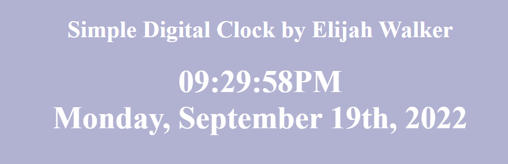

# SDMM-Task3-SimpleClock
### A simple digital clock
#### Styling has been limited intentionally, this project was to develop basic JS/HTML DOM manipulation skills

You can view the clock [here](https://elijahcw-git.github.io/SDMM-Task3-SimpleClock/)

### Summary

I am currently a mentee of popular Youtuber Andy Sterkowitz, a self taught developer. I am new to the program and was tasked to create a simple digital counter. The styling of the clock is intentionally limited. The clock uses the JS date object and pulls several parameters in order to make a properly formatted date. 

### Author

* Elijah C Walker - Systems Engineer / US Navy Veteran / MS Computer Science Candidate/ BSEET / CompTIA Sec+ / TS-SCI Clearance
   
